# Geological Walks in Charnwood Forest

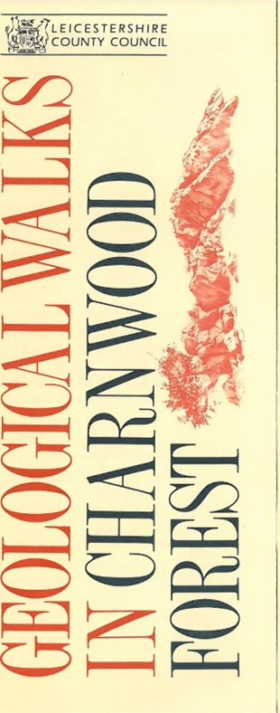

## Introduction 

The rocks of Charnwood Forest are some of the most ancient in England and Wales. They were formed in Precambrian times, about 700 million years ago, and are hard and resistant, giving a rugged landscape which is unique in the Midlands.
The rocks are of two kinds; some are silts and sands laid down in a shallow sea. However, somewhere to the north west active volcanoes erupted ash and lumps of  rock which fell back into the sea and came to rest along with silts and sands on the sea bed. Rock debris eroded from a landmass to the south was also carried into the sea to become mixed with the volcanic debris. Occasional earthquakes caused submarine avalanches, resulting in further mixing and upheaval of the layers of settling sediments. Over many thousands of years, layer upon layer of sediment gradually built up and hardened into rock.

Geologists divide the Charnwood Forest rocks into three Groups. The oldest rocks in the area, the Blackbrook Group, were formed at a time when the volcanoes ejected a more or less continuous rain of dust and ash, building up great thicknesses of sediment. Then followed the Maplewell Group, a series of rocks formed at a time of violent explosions; large lumps of volcanic debris, as well as dust, blasted from the volcano to settle out and form rocks we call agglomerate and tuff. In the course of time the volcanic eruptions became fewer and finally petered out. Although the volcanic activity had ceased, the wind, frost and running water continued to erode the landmass to the south. Rivers carried pebbles and silts to the sea so the build-up of sediments carried on but without the input of volcanic rocks. These rocks are called the Brand Group.

One feature of the rocks you will see on the walks is that some of them are cleaved. Cleavage occurs where the  rocks have been strongly compressed. Minerals in the rock change position and align themselves so that the  rock tends to break in a new direction rather than along the original layers. This occurs more readily in the fine grained sediments; the strong cleavage in some of the  siltstones and volcanic dust rocks of Charnwood allows them to be split thinly and these rocks have been quarried for slate. Good examples of slaty cleavage can be seen around Swithland, Bradgate Park and Woodhouse Eaves.

The thick layers of the Precambrian rocks have suffered sideways compression and have been folded into a large arch-shaped anticline. The top of the anticline has been eroded away revealing a core of the older rocks  belonging to the Blackbrook Group.

Another type of rock which outcrops in the Forest is markfieldite. It is made of the minerals labradorite feldspar, hornblende and quartz, whose alteration has produced an attractive pink and green mottled appearance. Markfieldite has been extensively quarried in the area for building stone and road metal. Inok out for it in and around Leicester, where it has been used for kerbstones, setts and in the walls of churches etc.

In many areas of the Forest, Triassic sedimentary rocks blanket the ancient Precambrian layers. Remember that during Precambrian times much of Charnwood Forest was submerged beneath the sea. The Triassic rocks were formed many millions of years later when the Forest was land under desert conditions. Sandstones and limey mudstones (marls) were deposited, forming layers of red and greyish green sediments. The Triassic sediment cover accounts for the more gentle rolling landscape between  the rugged outcrops of Precambrian rock. Triassic rocks can be seen in Bradgate Park and in some of the quarry sections.

## Glossary

ANTICLINE — an arch-shaped fold
AZURITE — a blue copper mineral, a valuable ornamental stone.
AGGLOMERATE — a volcanic rock with fragments mainly larger than 2cm.
BED — a layer of rock.
BRECCIA — a rock made up of angular fragments. CLEAVAGE — the way in which the rock tends to split. CONGLOMERATE — a sedimentary rock made up of rounded pebbles.
DYKE — a sheet-like intrusion of igneous rock which cuts across the layers of host rock.
FAULT — a fracture in the rock caused by earth movement.
GALENA — a heavy lead mineral, the main ore of lead. HEMATITE — an iron mineral which tends to stain rocks and minerals red and brown.
IGNEOUS ROCK - from the Latin word fiery; hot rocks which originate from within the Earth.
JOINT — a fracture in the rock.
LAMINATION, LAMINAE - thin layers of rock.
MALACHITE — a green copper mineral, a very valuable decorative stone.
PORPHYRY — an igneous rock with large crystals in a mesh of tiny crystals.
PRECAMBRIAN — the name of an era approximately 700 million years ago.
SEDIMENTARY ROCK - formed from the wearing away of pre-existing rocks, the weathered particles making up the sediments.
SLICKENSIDES — the fine scratches and grooves which develop when one rock surface grinds against another, for example during faulting.	Main Divisions of
SYNCLINE - a basin-shaped fold.	Forest Rocks

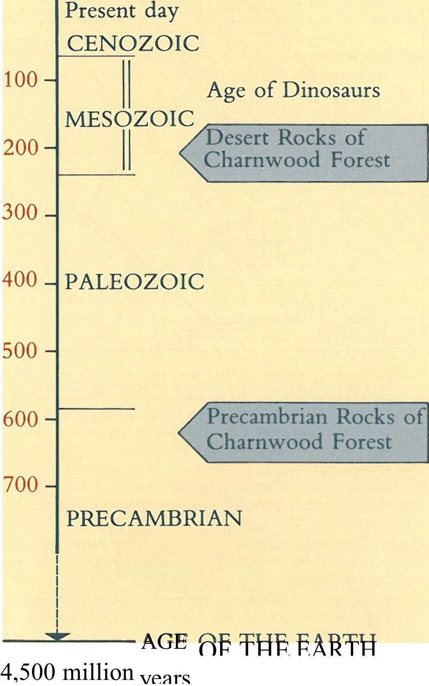
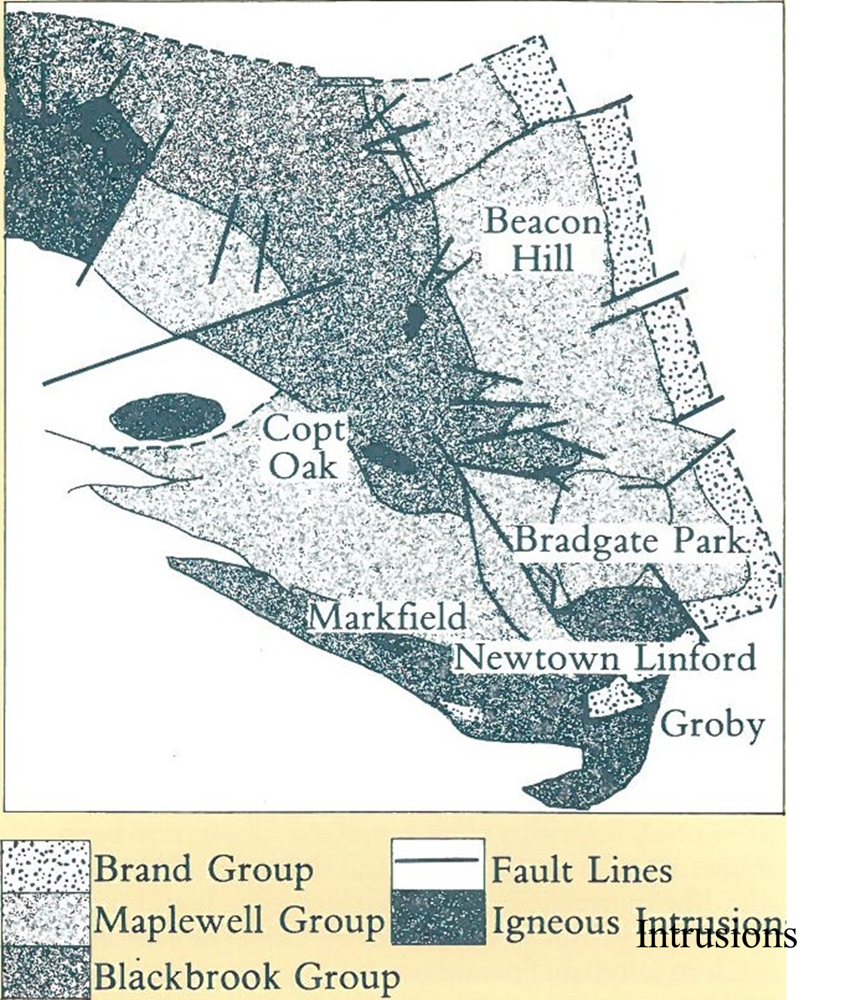
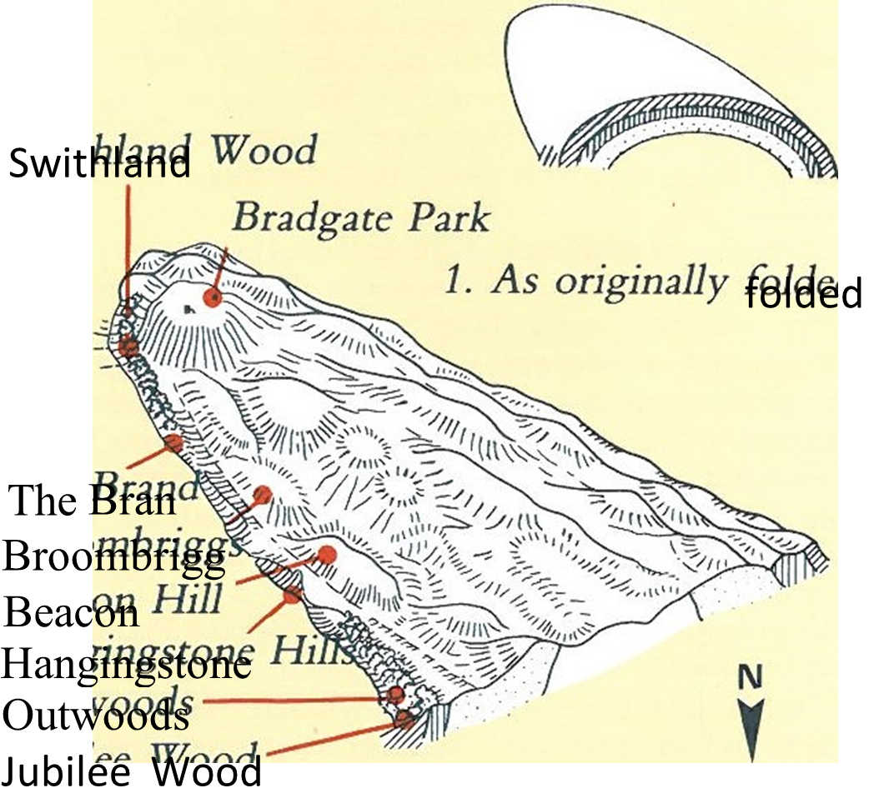
	
YOUNGES
ROCKS)
OLDEST
ROCKS)	Group	Formations
	THE
BRAND
GROUP	Swithland
		Brand Hills
	THE
MAPLEWELL
GROUP	Bradgate
		Beacon Hil
	THE
BLACKBROOK
GROUP	Blackbrook eservolr
		Ives Head

## Locations

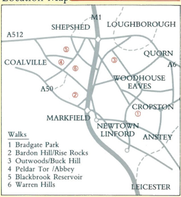

## 1. BRADGATE PARK - A CIRCULAR WALK OF ABOUT 6 1/2KM WITH SHORTER ALTERNATIVES TAKING APPROXIMATELY 3 HOURS 

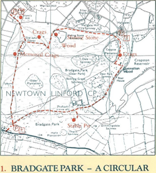

The walk starts at the car park at Newtown Linford. Alternatively car parks at Hallgates and Hunts Hill can be used so that you can devise your own routes and shorter lengths to suit yourself.
Bradgate park is a mediaeval deer park of some 344ha. It has retained much of its original landscape and natural beauty with its small woodlands, grassy slopes and rocky outcrops.
Take the main tarmac carriageway through Little Matlock Gorge of the River Lin. Notice the massive 'blocky' nature of the rock, clearly different from the layered sedimentary rocks at other sites in the Park. The outcrop is made up of the intrusive igneous rock markfieldite. Continue along the carriageway towards the ruins of Bradgate House but turn right over the bridge. Follow the path, into a shallow grassy basin to rocks known as Stable Pit. The main outcrop is made up of siltstones. Single grains of quartz can be made out, in some cases coated with the red mineral hematite. The rocks belong to the Brand Group; they are younger than the volcanic rocks seen in other  parts of the Park, and represent a quieter time when the volcanic activity had ceased. The siltstones have been distorted; looking towards the top of the outcrop you will see patches of white crystalline quartz in tension gashes which formed as a result of shearing of the rock when it folded. In the corner of the pit is a very weathered, narrow strip of rock running vertically up the outcrop. The rock is a dyke of markfieldite, an offshoot of the much larger intrusion at Little Matlock Gorge.
Returning to the main carriageway, pause to look at Bradgate House, one of the earliest unfortified grand houses in England.
Completed in 1502 for the Grey family whose strong ties with the  Royal Family declined after Lady Jane Grey, 'the nine day Queen' was beheaded by Mary Tudor in 1554. While you are at the Ruins you will probably hear the peacocks calling. As you Continue towards Hallgates, you may see red and fallow deer among the bracken.
On reaching a small enclosed group of trees known as Coronation Wood, take a left turn towards Coppice Plantation and the crags below overlooking Cropston Reservoir. Here, the fine grained rocks of volcanic dust are strongly cleaved to give slates. Some layers show what is called refraction cleavage, which occurs where there are alternating beds of fine and coarse grained rock. The fine grained beds tend to cleave very well, the coarser grain beds less well and at a different angle. This produces a "zigzag" effect over the whole rock face.
Over towards the Hallgates end of Coppice Plantation look out for the small outcrops at ground level. They are sediments which were laid down when the volcanic eruptions had come to an end. The main source of  sediment was now from weathering and erosion of the land mass to the south. Pebbles can be seen in the outcrop; they make the rock a conglomerate, and were probably deposited as shingle by a river carrying
weathered material from adjacent hills. These outcrops are part of the Brand Group already seen at Stable Pit.

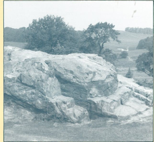

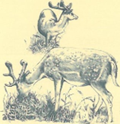
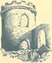
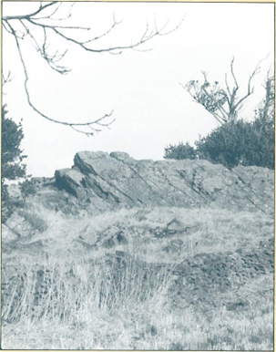
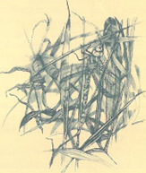

Bearing round the side of the plantation, turn left, going downhill to join a track to Old John. Go through the gap in the wall, moving slightly to the right to reach a higher path by the side of another wall. You will pass wet heath on your left which can be boggy at times. It is a part of the Charnwood
Moorland of which Bradgate Park is the largest surviving area. Continue uphill to a covered reservoir and a short stretch of tarmac path. Bear left around Sliding Stone Wood to small groups of silver birch trees. The crags are easily recognisable by the oak tree growing out of a large split in the rocks. The outcrop is composed of agglomerate erupted from the volcanoes to the north west. Towards the right of the outcrop, the original bedding can be made out. Finer grained sediments make up these layers. The once horizontal beds are not tilted and slope towards the south east. Notice the thin laminae, each representing a single eruption of fine dust from the volcano. By the tree and around the Sliding Stone Wood side of the outcrop is a different picture; again the rocks are made up of ash and dust which settled out on the sea floor to form a
thick "soup", but these beds have been contorted, buckled and torn apart.
Earthquakes may have caused instability on sea floor slopes. Look out for the pale coloured twisted lumps in the rock face. They are remains of fine grained layers which have been bent and overturned like plasticine as they slumped downslope to produce a mangled mix of rock called slump breccia.
Move on to Old John, a Folly Tower, built in 1786 of local stone, in memory of Earl of Stamford's old retainer who was accidentally killed. The outcrops around the Tower are fine grained deposits similar to those seen at Beacon Hill. They are interbedded silts and mudstones sometimes thinly laminated.
Leaving Old John, go through the adjoining spinney to the War Memorial and crags beyond. This prominent outcrop is made up of more volcanic sediments of the same type as at the Sliding Stone, and part of the Maplewell Group. The original layers dip steeply away from the War Memorial. Important Pre-cambrian fossils have been found in rocks of the Maplewell Group. Small fronds and disc-like impressions, they are thought to have been formed by primitive animals rather like sea-pens and modern jellyfish. Specimens of these rare Charnwood fossils can be seen at New Walk Museum, Leicester.
Going downhill, take one of the tracks back to the Newtown Linford car park. Should you have started at Hunts Hill car park, on your return notice through Hunts Hill Wood the scattered boulders. Looking closely you will see that they contain pink fragments in a fine grained mixture of grey ash. The rock was formed by hot rubble blasting out of the volcano, and welding itself together as it came to rest and gradually cooled. This type of rock is called volcanic agglomerate.

## 2. BARDON AND OLD RISE ROCKS A WALK OF ABOUT 5KM TAKING APPROXIMATELY 1 1/2 HOURS

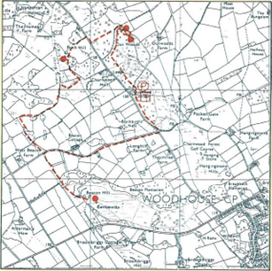
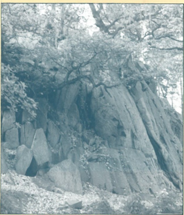
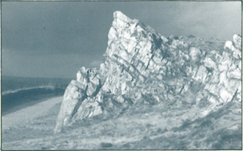
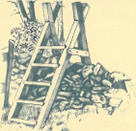

Park your car in the lay-by on the north side of the A50 at the footpath sign. Cross a stile into an arable field, following the path with the hedge on your left. This is an ancient boundary of Bardon Deer Park. This large park, part of the Manor of Whitwick, was enclosed from Charnwood Forest in the 13th century. It covered an area of about 510ha (larger than Bradgate Park), and had a perimeter Of nearly 9 1/2km.
Continue until a house comes into view amongst. trees in the left hand corner of the third field. Enter the next field for about 10m. Old Rise Rocks can be seen on the right, although there is  no public access to them. They form part of the Maplewell Group, and are made up of interbedded layers ashes and dust tuffs. The layers tilt away from the Charnwood Forest anticline; a better view of this structure will be seen from the top of Bardon Hill.
Retrace your steps into the previous field. Turn right through a gap in the wall and right again. Follow the headland around the arable field and go down the hill. Continuing with the hedge on your right, enter the next field. You may see clumps of yellow flowered lesser spearwort (Ranunculus flammula) which flowers during the Summer and early Autumn.
Bear left around the hedge and then right into the next field passing an overgrown pond with its yellow Iris (Iris pseudacorus) to reach the far right hand corner.
Turn left here and almost immediately turn right through a gap  in the hedge to a stile in fence. Follow the footpath alongside a woodland to a footbridge and stile beyond.
Continue through trees to meet a metalled track, crossing a field to outbuildings near an electricity pole.
Go over another fence, along a track and across a driveway. Bearing slightly to the right, continue up a short grassy slope to a notice of blasting times and a public footpath sign.
The footpath now winds upwards to the summit of Bardon Hill, the highest point in Charnwood Forest and Leicestershire at 278m. On the way it passes through a scots pine plantation also containing birch, oak and rowan, which changes to oak scrub amongst rocky outcrops as you continue to the top. On reaching a small open space, a few metres left of a brick building near a mast, pause here to look back in a south-easterly direction. Good views can be seen of Old Rise Rocks, the disused Markfield Quarry and to the right Cliff Hill Quarry and Billa Barra. Continue to the trigonometrical point on the left and the fenced off Bardon Quarry below. Bardon Quarry is made up of a complicated series of volcanic breccias and porphyries. Some of the rock was ejected on to the surface as lava while some rock cooled and crystallized below ground. Faulting has crushed the original rock to form breccias. The dark red, nearly horizontal beds towards the top of the quarry face were formed many millions of years after the igneous rocks that are being quarried here. The sedimentary rocks are of Triassic age; they formed about 210 million years ago in desert conditions. Flash floods carried boulders and rubble, carving out river valleys called wadis. Beneath the sedimentary cover, mineralised fluids worked their way down into faults and fractures in the igneous rock below, depositing copper and lead minerals such as green malachite, bright blue azurite, and grey metallic galena. Gold has been found in the area of Bardon Quarry, but in very small quantities and certainly not enough to start a gold rush!
The igneous rock of Bardon is an important source of roadstone and extensive quarrying has removed a large part Of Bardon Hill. Charnwood Forest, with six hard rock quarries, is England's foremost source of roadstone.
Retrace your steps over the footbridge, turning right at the stile in the fence. Keep the hedgeline on your right and continue to  Old Hall Cottage, an attractive area with a moat and pond. The moat marks the site of Bardon Park Hall demolished in 1840. The new Hall (built in 1835) can be seen about 800m away on the south side of Bardon Hill. Turn left over the bridge by the pond and bear right at the left side of the field. Continue to a gap in the hedge, in the second field, turning right over a small footbridge to return to the lay-by.

## 3. OUTWOODS AND BUCK HILL - A CIRCULAR WALK OF ABOUT 5 1/2KM TAKING APPROXIMATELY 2 1/2 HOURS

This walk starts at the Outwoods, an area of about 44ha of mixed oak and coniferous woodland. This is an ancient forest site and although most of the original oak has been felled and re-planted, it still retains a rich flora and fauna.
The path goes to the left of the car park and around the toilets. Take a left fork and then immediately a right fork through bracken and brambles to conifers beyond.
Bear slightly left by small rhododendron bushes. Continue  down the slope, noticing as you pass the needle covered woodland floor and the absence of smaller woodland plants. The soil here is very acidic and because of this and the shade, these plants cannot exist.
Bear left over the small bridge and follow the well-defined path. This is part of the Outwoods Nature Trail and further information about it can be obtained from Charnwood Borough Council.
Go over the next bridge near a seat on your right; to cross into a new plantation of mixed broad leaved and coniferous trees. The path leads to a wide track. The two big trees between which the path runs are sweet chestnut. Turn right here, passing a stone in memory of the founder of the Men of the Trees and commemorating the opening of the plantation by H.R.H. Prince Charles in 1985.
Keeping the Jubilee Wood boundary on the left continue along this way to a kissing gate in the corner of a wall. Do not go through the gate but bear right here, passing a seat nearby to a
 
rocky outcrop with an oak tree growing out of it. You will see  that the layers, once horizontal, have been contorted by earth movements and now stand almost vertical in large folds. The rocks are mostly made up of medium and fine grain volcanic ashes and tuffs. Careful searching of some areas of the rock will reveal large fragments weathering out of the crag face. This type of rock is conglomerate; it was formed by the input of larger fragments, such as sand and pebbles, to the shallow sea where the volcanic ash was also settling out.
Bear left around the outcrop and up a short steep slope to the top of the ridge. Smaller outcrops can be seen to your left. The very thin layers of rock are bent and distorted. Some layers contain coarse, angular fragments of rock; possibly the sediments slid downslope and the different layers were broken up and mixed together. Some of the rock faces have patchy crusts of grey quartz. This developed  when one rock face ground against another deep underground and caused scouring. Grey quartz crystallised out of mineral-rich fluids between the rock faces. Earth movements such as faulting can cause this grinding effect, and indeed the presence of slickensides in the Outwoods is probably due to the Pocketgate Fault which runs along the length of the woods.
Returning to the seat, by the kissing gate you will see opposite a gap in the fence. Enter Jubilee Wood here, follow the markers in a 

westerly direction through mixed woodland of beech, larch, scots pine and oak. Go through this wood to reach a gap in the roadside boundary and turn right on Woodhouse Lane. After about 109m cross to a stile adjacent to a Permissive Path notice. This road can be busy, and care should be taken of approaching traffic from each direction. Cross the stile and a small field to reach another stile over a wall. As this is not a public path, follow the waymarked route, keeping all dogs on leads. There is a possibility that it may be closed occasionally. Please respect any notices to this effect. The path now takes you through bracken and follows a wall on your left to another stile into a field. Keeping the field boundary on your right, continue to the next stile over another wall to a short steep slope and higher ground beyond.
This is Buck Hill, a small sharp ridge amongst scrub overlooking the quiet valley of the Woodbrook. There are good views of Nanpantan Hall and the surrounding landscape.
The rocks here are part of the Maplewell Group. You are standing on the eastern side of the Charnwood Forest anticline; if you look across the valley you are looking towards older rocks in the core of the arch of the anticline. The small outcrops on the ridge are made up of very fine volcanic dusts and tuffs, a rock sometimes referred to as hornstone. It contains a large amount of silica and feels 'soapy' when touched. The hornstone has weathered to striking pink, green and cream colours. The original layers have suffered sideways compression and a crumpled effect is visible.
The path now descends down through bracken and mixed oak and coniferous woodland to a gap in a wall. Go through to a  signpost for Beacon Hill.
Follow the well-defined path through more bracken, turning left over a wooden bridge and through a handgate. Bear left around the brook and follow the waymarks. Before the enclosure in 1808 of this part of Charnwood Forest, the high ground was mainly covered with bracken and gorse and the lower wetland with rushes and marsh plants.
At the third field the path turns over a stile and the brook. There are some flat stones to aid the crossing. Follow the path uphill, passing trees on your right. Go through a gap in the wall, continue to climb through mixed woodland, noticing as you pass the large rosettes of foxglove leaves. It has spikes of pinky-purple tubular flowers appearing through the summer. Carry straight on over a stile, turning left into Dean's Lane.
There are fine panoramic views of Loughborough as you continue downhill to the junction of Woodhouse Lane and Breakback Road.
Take care when crossing the road to the five-bar gate. Go through the gap adjacent to the gate into the Outwoods. Turn left following the footpath back to the car park.
This walk may be extended to include the Country Park at Beacon Hill by not turning left at the end of the Permissive Path into Deans Lane, but continuing along the 'Jubilee Walk' which is marked with a sign in Deans Lane saying footpath to Beacon Hill.
 
 

This route may be walked in the reverse direction by starting from the main track at Beacon Hill below the summit and going through a gap in the wall; bearing left down a slope, around a rocky outcrop to reach the far corner. Turn left, going through the short avenue of beech trees to the handgate in the corner to start the Jubilee Walk. Cross Deans Lane to the stile by the Permissive Path notice for Buck Hill, or turn right and go downhill for the Outwoods.
Beacon
The points of geological interest at Beacon Hill can be reached from the Upper Beacon Car Park off the Beacon Road (B.591) and walking the last 100m to the outcrops.
An attractive alternative is the use Of the Lower Beacon Car
Park off Breakback Road (signposted to Outwoods and Nanpantan) and walking the mile through rhododendrons and silver birch trees.
Beacon Hill, a Hill Fort, probably dating from the late Bronze Age, is the second highest point in Charnwood Forest at 248m. To the west are views of Bardon Hill and the volcanic centre of Whitwick. Over to the east is the Soar Valley with its associated younger layers lapping against the ancient arch of Precambrian rocks on which you are standing. The Beacon Hill rocks belong to the Maplewell Group, and are composed of very fine grained dust tuffs with occasional layers of coarser tuff. The fine grained layers are rich in flint-like silica, and are often referred to as hornstones; although green when freshly broken, the rocks tend to weather to a white or creamy colour. Folding has formed a srnall syncline, and sideways compression has resulted in crumpling of the layers into a basin-shaped fold, in this case tilted down towards the east.

## 4. PELDAR TORAND MOUNT ST. BERNARD ABBEY - A CIRCULAR WALK OF ABOUT 5KM TAKING APPROXIMATELY 2 HOURS

This walk starts from the north side ofB587 in Whitwick close to Hogarth Road. Take the signposted track that runs alongside a white house. This well-used path climbs steadily to Ratchet Hill. It leads past grassy verges with harebells in summer and blackberries in the autumn. The rocks can be seen on the left amongst the trees.
Most of the outcrops seen on this section of the walk are porphyries. They are the same rock type that occurs in the area of the remnant volcano at Peldar Tor which you will be able to see later in the walk. The rock has a dark purple or black colour which sometimes weathers to white.
Just below the top of Ratchet Hill on the Mount St. Bernard side there is a good view of one of the outcrops from this side of the wall. Again the rock is porphyry, but notice the paler coloured lumps of rock incorporated amongst it. The lumps are pieces of volcanic breccia which have been caught up in the flow of porphyry lava. Some patches of lava are a little different; they cooled very quickly to form a glass. The porphyry lava however cooled more slowly and consists of a mixture of large crystals in a mesh of smaller crystals.
As you follow the path downhill to reach a track you will see good views of the surrounding landscape and in the distance Ives Head containing some of the oldest rocks in Charnwood Forest. Turn right and after about 40m climb a concrete stile into the field beyond. Follow the well-defined path to meet the signpost at the road. Turn right along the road for a short way to the next signpost. Turn right again into a clump of trees following the wall to a stile. Turn left and over the next stile to cross a field to the driveway for Mount St. Bernard Abbey. Bear right to the car park and the Abbey.
This was founded in 1835 and a permanent Monastery was built in 1844, designed by the famous architect Augustus Welby Pugin. There is a shop open six days a week and a guest house.

!> The abbey is closed after 7.30 pm.

To the right of the church you will see a large outcrop. These are rocks from the Maplewell Group, composed of welljointed layers of pink coloured ashes and agglomerate.
Keeping the car park on your left continue to the corner of the far out-buildings, turning right along a track with a wall on your right. Many walls in the Forest are built of local stone and on closer inspection can reveal interesting features. Look out for 'bombs' in the purple coloured porphyry making up the walls. The well-rounded lumps are thought to have formed either by hot gases within the volcano, or by the downslope movement of material as it was ejected away from the volcano.
Follow the track to the far corner. Bear right and walk up to the field boundary, keeping a house on your left. Go over the stile and with the wall on your right continue to the fence and gorse bushes beyond. Follow the winding path to a stile into a field which you cross to a concrete stile. Take the path through trees to reach a T-junction with a quarry track. Turn right and after a short distance you will come to an impressive view of Peldar Tor Quarry.
This area is thought to represent the remains of one of the Precambrian volcanoes. The volcanoes here and to the north west provided the source of all the volcanic material ejected over Charnwood Forest, including 'bombs', blocks of rock and finer material. Some of the rock at Peldar Tor was probably ejected beneath the surface, while it is thought that in other cases it was ejected out as lava. Earthquake activity added to the complicated mix of rocks with faulting and earth movements grinding up the original rock to form fault  breccias.
The red layers above the igneous rocks are sedimentary rocks, formed in Triassic times 220 million years ago under semi-arid conditions.
Peldar Tor Quarry has long term reserves of hard rock for use as aggregate in the construction of roads and buildings. Agreements between the owners and the County Council ensure that the	 impact on the local environment is kept to the minimum possible.
Continue uphill, keeping well clear of the quarry edge. Turn right, and then left over a stone wall, following the path along the foot of the embankment, and through the trees. Turn right at a large sign warning of blasting times, then follow the track, turning left for the return journey to Whitwick and B587.
 
into sight. The original reservoir was built in 1796 to feed the Charnwood Forest Canal. It was dismantled in 1804 and the present reservoir was completed in 1906.
At the bottom of the field turn right, crossing an area, sometimes muddy, to a stile into One Barrow Lane. Turn left here and go over the bridge.
The reservoir has flooded the original deep gorge of the Blackbrook. It is from this area that the Blackbrook Group of rocks were named. Here are some of the earliest formed rocks in Charnwood Forest and hence the oldest. They were formed by a more or less continuous rain of dust from the volcano which built up great thicknesses of a sediment. The noticeable red staining of the rock is	 caused by the presence of the iron mineral hematite. Examples of the rock formation can be seen in the high rocky

## 5. BLACKBROOK RESERVOIR A WALK OF 1.6KM TAKING ABOUT % OF AN HOUR 

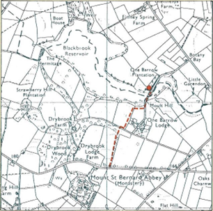
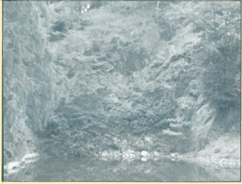

Bear left down a short slope on a well-defined path. This is not This walk of about 800m to Blackbrook Reservoir is waymarked  	a public right Of way but kind permission has been given by the to One Barrow Lane and starts on the north side of Oaks Road,Trust. Please follow the marked route, keeping all dogs on leads. about 100m east of the entrance to Mount St. Bernard Abbey. AtWith the wall on your left, continue beyond a clump of silver the signpost, go through the gap in the wall and following thebirch trees to a large outcrop near the path on your right. yellow waymarks, continue through mixed deciduous woodlandThe rocks here belong to the Maplewell Group. They and bracken to a stile near a track. Enter the next field and as youwere laid down at a time of great explosive volcanic continue downhill pleasant views of Blackbrook Reservoir comeactivity. The middle section of the lower outerops show breccias, where large blocks of rock have been crushed and folded and incorporated amongst a mix of finer grained rock. Blocks of slate up to half a metre in length have been found in the breccia. These blocks can be easily recognised in the rock face, because they have been weathered to striking white, red and green colours.

## 6. WARREN HILLS - A CIRCULARImmediately to the left WALK OF ABOUT 2 1/2KM TAKING of this section is a very APPROXIMATELY 1 HOUR

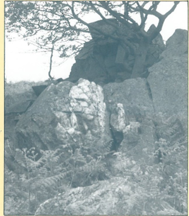
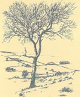
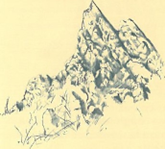
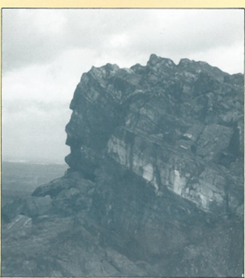

different kind of rock called porphyry, recognis. Start at the lay-by on the north side ofB587. Go through theable by its distinctive dark kissing gate into the Nature Reserve of the Leicestershire andpurple colour. It was Rutland Trust for Nature Conservation. Once known as Highformed when hot, liquid Towers or High Tors, Warren Hills is unusual for its craggyrock was injected into the moorland landscape with purple moor grass and bracken. Gosurrounding rocks. Some across a field to a gap in a wall. Bearing left through an opening inof the liquid cooled and another wall, you will see a jagged and needle-like line of outcropscrystallised slowly and so beyond.formed large crystals, but
 
then at some stage the rock must have finished crystallising quickly so that only very small crystals had time to grow; the result is a type of rock which has large crystals in a fine grained mesh of smaller crystals. Look closely to see this in the outcrop.
The path continues through a small group of trees. Notice as
 
you pass the shallow roots of a beech tree. The soil here is very thin because the rocks beneath weather slowly.
As you enter the next field to reach the far wall, good views of Whitwick and Bardon come into sight on the left. Go through the gateway.
On your right you will notice another outcrop. The rocks at this end of Warren Hills are fine grained layers of dust tuffs rather like those seen at Beacon Hill and Buck Hill. Notice the original layering of the rock and see how steeply tilted they now are. A strong vertical cleavage has given the rocks a sharp jagged outline.
To complete the circular route take the path on the left opposite the gate near the road. Climb the gentle slope to reach a wall on your left. Continue on this path to return to the lay-by, pausing to look back at views of the Abbey and surrounding landscape.

## OTHER PLACES OF GEOLOGICAL INTEREST

There are other places of geological interest which can be visited by the public. Swithland Slate Quarries
Swithland Wood, managed by the Bradgate Park Trustees, as part of the Bradgate Park Country Park, has a number of deep slate quarries, the legacy of a oncethriving Charnwood Forest industry.
The 'slaty' cleavages, caused by a strong compression in the rocks, allows them to be split easily into thin sheets. The Romans used this material mainly for roofing purposes and Swithland Wood was almost certainly quarried by them during the period 100-400 A.D.
By the 18th Century slate was being used for roofing, headstones, milestones, sundials, gateposts and for some household items.
With the improvement of transportation, the slate industry expanded in the 19th Century but cheaper Welsh slate then flooded the market, and the local industry declined rapidly.
For further details a leaflet "Leicestershire Slate Industry" can be obtained from the Leicestershire Libraries and Information Service, Thames Tower, Navigation Street, Leicester, LEI 3TZ.
Altar Stones, Markfield
The Altar Stones date from the Pre-Cambrian period consisting of well-bedded volcanic ash tufts together with slump breccia rocks. The site is regarded as the most important exposure in Charnwood Forest of the slump breccia rock type.
Access is along Altar Stones Lane near the A50  Markfield bypass. From the road, the large rock outcrop can be seen on the right amongst scrub and gorse.

## ACKNOWLEDGEMENTS 
This leaflet has been prepared by Leicestershire County Council  Planning and Transportation Department with considerable help from the Geology Section of the County Museums Service. Our gratefll thanks also go to the following for their generous co-operation:
A.R.C. Limited, Eastern Region Bardon Hill Quarries Ltd.
Bradgate Park Trustees
Charnwood Borough Council
The Lßicestershire and Rutland Trust for Nature Conservation The Abbot, Mount St. Bernard Abbey The Executors of the late Miss J.F. Paget.
Beacon Hill and Jubilee Wood are owned by the County Council and managed by the Director of Property, County Hall, Glenfield.

!> Geologists who study rocks for scientific purposes need to hammer away samples on many occasions. If everyone did this there would soon be no rocks. so NO HAMMERS ARE ALIDWED AND NO SAMPLES ARE BE TAKEN AWAY.

Additional information on the geology of Bradgate Park can be found in "The Rocks of Bradgate" by Trevor D. Ford and published by the Bradgate Park Trust.

## FOR YOUR GUIDANCE
 
On all the walks, but especially at Peldar Tor, Warren Hills and Blackbrook — please ensure that you park your car safely and without inconvenience to others.
You will find that most walks will be easy to follow from the guidance in this leaflet. In a few places yellow waymarker arrows have been provided to assist you, and for greater clarity some of these will have a distinctive red diamond.
Parts of the walks can be muddy in wet weather and you should be prepared with adequate footwear.
If you open a gate, please see that it is closed and fastened behind you.
If you have a dog, please keep it under proper control. It must-be on a lead on the Permissive Path to Buck Hill, and it is much the best for it to be on a lead elsewhere. Please be sure to avoid all risk of fire.
Maps reproduced from the Ordnance Survey l: 25000 maps with the permission of the Controller of Her Majesty's Stationery Office. O Crown Copyright.

The Countryside Commission is supporting Leicestershire County Council in developing projects that help people  use and enjoy the Leicestershire Countryside.
L E I C E S T E RS H I R E
COUNTY COUNCIL
LANDMARK
ENVIRONMENTAL ACTION COUNTYWIDE
Supported by the
COUNTRYSIDE COMMISSION

